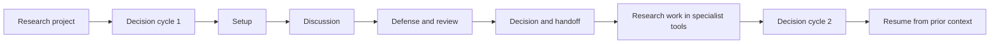

# Envisioned Research Workflow

> Status: Product vision, not a description of the current implementation.

## Document map

- Sections 1 to 4 define the product purpose and explain projects, decision
  cycles, phases, artifacts, and later-cycle continuity.
- Sections 5 and 6 show where decision cycles occur and how specialist roles
  work together.
- Sections 7 to 10 describe the four recurring phases in detail.
- Sections 11 to 13 define execution work, decision records, provenance, and
  reproducibility.
- Sections 14 to 16 cover reliability, contribution and authorship, and the
  course-mode overlay.
- Sections 17 and 18 provide a realistic example and map the vision to the
  current Popping model.
- Sections 19 to 21 translate the workflow into product priorities, anti-goals,
  and success criteria.

## 1. Purpose

The system should help a research team preserve scientific intent from the
first question to the final decision. It should remember what changed, make
evidence and decisions traceable, coordinate specialist handoffs, and keep
uncertainty visible.

The system assists judgment. It does not silently replace it.

The central product idea is a **research decision room**. Researchers already
use specialist tools for literature management, code, notebooks, data storage,
experiments, and writing. This system should connect those activities around
the questions that require coordinated human review:

- What exactly are we trying to learn or decide?
- What evidence do we have, and how trustworthy is it?
- Which design, dataset, or analysis should move forward?
- What objections or risks remain unresolved?
- Are the results strong enough to support the intended claim?
- What was decided, why, by whom, and what happens next?

The value is not another chat interface. The value is continuity,
coordination, provenance, reviewability, and reusable project memory.

### Why a team adopts it

A team adopts the system when the cost of lost context, repeated explanation,
or weak handoffs exceeds the small cost of maintaining a decision record. It
should help the team:

- Avoid briefing every reviewer from the beginning
- Detect that a changed outcome definition affects two figures and an earlier
  claim
- Preserve why a tempting analysis was rejected instead of proposing it again
- Show which approval condition is still blocking data collection or release
- Produce a review-ready package from the evidence, decisions, versions, and
  actions already recorded

The central interaction principle is: **the system imports, infers, and drafts;
people verify scientific decisions, uncertainty, and exceptions.** It should
pull metadata and changes from authoritative tools, prefill known context, and
ask users only about unresolved or consequential points.

The system is usually not worth using for a trivial, reversible solo choice
with no downstream dependency, review, or need for a durable record.

## 2. Who the workflow is for

The default case is a research lead working with a team of three to eight
people. The team may include domain specialists, statisticians, machine
learning researchers, data engineers, evidence reviewers, writers, students,
and external reviewers.

The same person may hold several roles in a small team. However, for an
important scientific decision, the person proposing a claim should not be its
only reviewer.

The workflow should support:

- A faculty lab deciding whether and how to pursue a study
- An applied research team choosing among designs or models
- A team reviewing whether a dataset is adequate for an intended claim
- A systematic review team resolving evidence and inclusion decisions
- A multi-person analysis moving from protocol to results and manuscript
- A course research sprint in which student teams investigate and defend
  research positions
- A later replication or update that must reuse the earlier record without
  starting from zero

## 3. The operating model: project, decision cycle, phase, and artifact

### Project

A **project** is the long-lived research workspace. It contains the scientific
purpose, members, permissions, evidence, data references, decisions,
artifacts, and history.

### Decision cycle

A **decision cycle** is one bounded research review and decision process. A
complete project normally contains many decision cycles.

Researchers already use the word "run" for an experiment, simulation,
training job, or pipeline execution. The product and data model should reserve
**decision cycle** for this workflow object. In the user's terms:

- **First run** means the first decision cycle in a project.
- **Later run** means a new decision cycle that inherits approved project
  context and links back to earlier decisions.
- **Experiment run** or **compute run** means an analytical execution and is
  recorded as an artifact or result, not as a workflow cycle.

Examples of decision cycles include:

- Decide whether a hypothesis is worth pursuing
- Select a study design
- Approve a data collection protocol
- Decide whether a dataset is analysis-ready
- Approve a primary analysis plan
- Review whether results support a particular claim
- Decide what must change before a manuscript is released

An active decision cycle may return to an earlier phase or pause while assigned
work is completed. It should eventually end with a decision or documented
deferral. Once finalized, its decision and version history are append-only.
New work creates a linked successor cycle rather than changing the finalized
record. Governed correction, withdrawal, redaction, and lawful deletion remain
possible under the rules in Section 10.

### Phase

A standard decision cycle uses four recurring phases:

1. **Setup:** Frame the decision and assemble the right team.
2. **Discussion:** Develop evidence, alternatives, and objections.
3. **Defense and review:** Present a recommendation or finding and subject it
   to independent review.
4. **Decision and handoff:** Record the decision, conditions, actions, and
   artifact versions.

These are logical workflow states, not mandatory live meetings. A team may
prepare asynchronously or review a package without a presentation meeting.
The workflow burden should be proportional to consequence:

| Cycle mode | Appropriate use | Minimum workflow |
|---|---|---|
| Lightweight check | Reversible, low-cost, internal choice | Brief framing, named owner, recorded decision, and reason for any skipped phase |
| Standard review | Material scientific or resource decision | All four phases, with at least one relevant specialist reviewer |
| High-stakes or regulated review | Sensitive data, external claims, safety, policy, or regulated work | All four phases, formal sign-offs, independent review, and required governance gates |

Every cycle needs only a small core: the question and intended use, a named
owner, relevant evidence or artifact links, and a decision with its rationale
and status. Standard cycles add review criteria and a relevant reviewer.
High-stakes cycles add formal approval and protected governance gates. Other
fields are conditional or system-drafted. The interface should reveal them
progressively as risk or uncertainty requires.

An active cycle may enter an **Awaiting work** state between phases when a
pilot, simulation, data correction, robustness check, or revision is needed.
The assigned actions remain part of the same active cycle. Low-risk cycles may
combine or skip phases with a recorded reason, but no cycle may omit its
decision record, provenance, or required human approval.

### Artifact

An **artifact** is a versioned research object, such as a paper, evidence
table, dataset snapshot, code commit, notebook, analysis result, figure,
protocol, review report, or manuscript draft.

Artifacts should have stable identities and visible states:

- Draft
- Under review
- Approved for a stated purpose and decision cycle
- Superseded
- Potentially stale, pending impact review
- Archived

Approval belongs to a specific artifact version, purpose, decision cycle, and
approver. It is not a universal property of the artifact.

The path is not strictly linear. Before finalization, a review can return the
team to Discussion and a data problem can return the active cycle to Setup.
After finalization, new evidence revisits an earlier decision through a linked
successor cycle.

### At-a-glance workflow

| Work state | What the team brings | What the system does | What people decide | Primary ownership | What leaves the state |
|---|---|---|---|---|---|
| Setup | Existing context, decision question, constraints, artifacts, and candidate roles | Imports context, drafts the brief, and identifies missing or conflicting information | Scope, cycle mode, criteria, roles, approval rule, and readiness | Decision owner and coordinator | Approved decision brief and readiness record |
| Discussion | Sources, results, proposals, assumptions, and domain knowledge | Organizes claims, alternatives, objections, provenance, and changes | Which options remain viable and what additional work is needed | Relevant specialists with a facilitator | Evidence and option package with unresolved issues |
| Defense and review | Candidate recommendation or result and its supporting package | Applies review criteria and tracks concerns, responses, conflicts, and sign-offs | Accept, revise, block, defer, or request more work | Configured approver with independent reviewers | Review record, conditions, and recommendation |
| Decision and handoff | Evidence, review findings, dissent, conditions, and proposed actions | Verifies authority and versions, then drafts the durable record and handoff | Approve, reject, defer, withdraw, or proceed conditionally | Configured decision owner and approver | Finalized decision, actions, and versioned package |
| Execution and awaiting work | Authorized actions, specialist tools, and exact input versions | Tracks links, status, changes, provenance, blockers, and completion evidence | Continue, correct, escalate, stop, or return to a decision gate | Action owner, relevant specialist, and reviewer when required | Accepted artifact, impact summary, and next decision request |

## 4. Organization onboarding, project initialization, and repeated cycles

"First run" can refer to several different levels. The system should keep them
separate so that reusable policy is not confused with project-specific
scientific context.

### Organization or lab onboarding

This occurs once for a laboratory, course, institution, or research program.
It establishes:

- Identity, authentication, and approved integrations
- Data classifications and sensitive-data boundaries
- Permitted AI use and disclosure rules
- Default retention, review, and release policies
- Reusable role definitions, rubrics, and templates

These settings may be inherited by projects, but a project owner must see and
confirm any policy that constrains the work.

### Project initialization

This occurs once for each project. The system should:

- Import existing briefs, papers, notes, protocols, code links, data
  references, and drafts
- Extract a proposed project structure without treating extraction as fact
- Show a preview of what it inferred, what is missing, and what conflicts
- Ask the team to confirm the research purpose, intended claims, scope,
  constraints, data sensitivity, deadlines, permissions, and core roles
- Create the project artifact map, risk register, and unresolved-question
  register
- Provide an immediate useful view of the project, not only an empty workspace

Project initialization creates project-level defaults and shared registers.
The first decision cycle references and confirms or overrides those objects; it
does not create duplicate copies.

The system must distinguish:

- Information provided by a user
- Information extracted from an artifact
- A system suggestion
- A team-approved decision

### First decision cycle, or first run

The first decision cycle establishes how this project will use the workflow. It
should:

- Create the first decision brief and completion criteria
- Confirm the decision owner, specialists, reviewers, and approval rule
- Calibrate the review rubric and evidence threshold
- Offer a practice or dry review when the first decision is consequential
- Record the first phase-gate decisions and action assignments

The phase sections below use **first-run system behavior** to mean the first
time a project performs that phase, not organization onboarding.

### Later decision cycles, or later runs

A later decision cycle should resume, not restart. It should begin with:

- The selected predecessor or baseline cycle, including its outcome and status
- What changed since that baseline
- Which actions are complete, blocked, or overdue
- Which new papers, data, code, or results were added
- Which assumptions or decisions may no longer hold
- Which downstream artifacts may be stale
- Which objections remain unresolved
- Which work is waiting for review or approval

The system should reuse stable project context while requiring confirmation
when inherited assumptions matter. A predecessor may have ended in approval,
conditional approval, rejection, deferral, withdrawal, or a branch. The new
cycle must link to the relevant baseline rather than automatically selecting
the latest approved cycle. It should process new inputs incrementally, preserve
earlier versions, and show differences before any replacement or merge.

### Iteration inside an active cycle

Returning to discussion, waiting for a robustness check, or revising a defense
package does not create a new decision cycle. It is an iteration within the
same active cycle. Once the cycle is finalized, later work creates a linked
successor cycle and leaves the finalized record unchanged.

## 5. Where decision cycles occur in a research project

| Project stage | Example decision for a cycle | Typical artifacts | Likely expert lead |
|---|---|---|---|
| Idea and feasibility | Is this question important and answerable? | Concept note, prior work, feasibility memo | Research lead and domain expert |
| Evidence review | Is the existing evidence sufficient, conflicting, or incomplete? | Search log, evidence table, claim-source map | Evidence lead |
| Study design | Which design best answers the question under our constraints? | Protocol, estimand, power analysis, preregistration | Methods lead |
| Data readiness | Can these data support the intended analysis and claim? | Data dictionary, quality report, lineage record | Data and computation lead with methods lead |
| Analysis planning | Which primary and robustness analyses should be approved? | Analysis plan, code skeleton, simulation results | Methods and computation leads |
| Results interpretation | What do the results support, and how strong is the claim? | Results registry, diagnostics, sensitivity analyses | Methods lead and domain expert |
| Writing and release | Is the package accurate, reproducible, and ready to share? | Manuscript, figures, code, data statement, reviewer report | Writer or communication lead with independent reviewer |
| Replication or update | Does new evidence change the earlier conclusion? | Successor cycle, change report, updated artifacts | Research lead and independent reviewer |

Research work happens within and between these cycles. The system should track
the relationship between actions and artifacts without trying to replace
GitHub, Zotero, Jupyter, an electronic lab notebook, institutional storage, or
a trusted data repository.

### Parallel decision cycles

A project may have several active cycles at once, such as ethics review, data
readiness, literature review, and analysis planning. Each cycle should declare
its dependencies, shared artifacts, blocking conditions, and governing
decisions. A downstream cycle may prepare work while blocked, but it cannot
finalize a conflicting decision merely because it finished first.

When parallel cycles conflict, the system should identify the affected scopes
and route them to the configured authority for reconciliation. Precedence comes
from an explicit governance decision, protected gate, or dependency, not from
timing or majority vote. A shared artifact change should create an impact check
in every dependent active cycle.

In course mode, parallel teams may be separate cycles under one shared prompt
or separate workstreams inside a cycle. The instructor chooses the structure,
visibility, and point at which their conclusions are compared.

## 6. Team and governance model

Roles are responsibilities, not permanent job titles. Some roles are assigned
by expertise, while facilitation, recording, critique, and presentation can
rotate across decision cycles.

The role lists in later phases are a catalog of possible responsibilities, not
a required committee roster. The default operating pattern is one decision
owner, one operator or coordinator, the relevant expert, and an independent
reviewer when the cycle's risk requires one. In small teams, compatible roles
may be combined and shown as temporary hats.

| Canonical role | Primary responsibility | Default authority |
|---|---|---|
| Research lead or PI | Defines scientific purpose, scope, acceptable evidence, and intended claim | Serves as scientific decision owner only when named for the cycle |
| Cycle coordinator | Prepares the cycle, checks readiness, manages time, and follows up on actions | Owns process readiness, not the scientific conclusion |
| Domain expert | Checks construct validity, context, feasibility, and interpretation | Owns the domain recommendation; has veto authority only if explicitly delegated |
| Methods lead | Defines estimands, design, models, uncertainty, and robustness requirements | Owns the technical recommendation; has veto authority only if explicitly delegated |
| Evidence lead | Finds, screens, verifies, and organizes sources | Owns evidence provenance and search-quality recommendations |
| Data and computation lead | Owns governed data access, schemas, pipelines, environments, and reproducible execution | Owns data and implementation feasibility recommendations |
| Independent reviewer | Develops objections, checks alternatives, and verifies work independently | Can block closure only when the configured approval rule grants that authority |
| Recorder or synthesis lead | Maintains decision records, unresolved questions, contributions, and actions | Owns record completeness, not the decision |
| Writer or communication lead | Converts approved evidence into accurate claims, figures, reports, manuscripts, or public explanations | Owns communication fidelity, not scientific approval |
| Ethics, privacy, or compliance reviewer | Reviews consent, licensing, safety, privacy, and release constraints | Owns the applicable governance gate, which scientific approval cannot override |
| AI assistant | Searches, summarizes, compares versions, checks completeness, and drafts records | Never owns a decision, sign-off, veto, or independent review |

### Minimum viable team

A small decision cycle needs four responsibilities, even when one person holds
more than one:

1. A named decision owner
2. A coordinator and recorder
3. The relevant scientific or technical specialist
4. An independent reviewer for any material decision

Evidence, data, methods, domain, and compliance roles are added when the
question requires that expertise. Reviewer independence is the responsibility
that should not be combined for high-impact work.

### Temporary phase hats

Facilitator, review chair, presenter, methods defender, evidence defender, data
defender, red-team questioner, and reproducibility checker are temporary hats,
not separate permanent roles. Each temporary assignment should point to a
canonical role and record its scope, expected deliverable, backup, conflict
status, and completion status.

### Governance rules

Every cycle has the following governance values. Organization and project
defaults should prefill them, and users should be asked only about exceptions:

- Decision owner
- Accountable approver or co-approvers
- Required and advisory reviewers
- Delegated veto domains
- Quorum or sign-off rule
- Conflict and abstention handling
- Reviewer nonresponse deadline
- Deadlock and escalation path
- Who may create a successor cycle that supersedes the decision

A sensible default is that the configured decision owner and accountable
approver or co-approvers own scientific sign-off,
applicable compliance gates cannot be overridden, predefined technical
blockers require resolution or documented escalation, and other experts advise
while retaining visible dissent. A phase closes only when its configured rule
is satisfied.

Acknowledging that a record is accurate does not mean agreeing with the
outcome. The system should preserve dissent, abstention, and missing
acknowledgement without pretending that the decision was unanimous.

Material choices made in Setup, Discussion, or Review are phase-gate decisions.
They should be recorded immediately with an owner, rationale, and downstream
impact. The final phase composes these records into the cycle decision; it does
not reconstruct them from memory.

### General role rules

- One person may hold several compatible roles in a small team.
- A high-impact claim needs a reviewer who was not its sole author.
- Presenters and proposing workstreams should not review themselves.
- Domain, methods, data, and compliance assignments should follow expertise.
- Facilitator, recorder, presenter, and red-team hats should rotate when
  development and fair participation are goals.
- Conflicts of interest and abstentions should remain visible.
- AI may assist a role only within the project's approved data and AI policy.

## 7. Phase 1: Setup

### Purpose and completion criteria

Setup turns a broad topic into a decision-ready cycle. It is complete when the
team knows what decision is due, what is in scope, who owns it, what evidence
is required, which artifacts are relevant, and what conditions must be met
before discussion begins.

### What users provide and operate

Users provide:

- The research question or decision to be made
- Why the decision matters and who will use it
- Scope, population, setting, and explicit exclusions
- Candidate hypotheses, designs, models, or actions
- Intended claims and prohibited overclaims
- Deadline, deliverable, resource limits, and stopping criteria
- Existing papers, data references, code, protocols, figures, and prior
  decisions
- Known assumptions, risks, ethical concerns, and access restrictions
- Required expertise, member availability, and conflicts of interest

Users operate:

- Import and classify existing artifacts
- Confirm or correct the system's extracted project context
- Assign roles and workstreams
- Choose the review rubric and evidence threshold
- Set completion criteria for the cycle
- Approve the decision brief before the phase closes

### First-run system behavior

In the first decision cycle, the system should:

- Guide the team through a structured intake
- Build the initial project and artifact map
- Identify missing, ambiguous, and contradictory inputs
- Propose roles based on declared expertise, without assigning them silently
- Establish permissions, retention, and approval policies
- Create the initial assumptions, risks, and unresolved-question registers
- Offer a rehearsal or dry run before the first consequential decision

### Later-run system behavior

In later decision cycles, the system should:

- Carry forward stable context and approved conventions
- Ask what changed rather than repeat the entire intake
- Show open actions, prior conditions, and unresolved objections
- Detect new or changed artifacts and identify their likely impact
- Rotate eligible roles while preserving expertise-dependent roles
- Allow a decision cycle to branch from an earlier decision
- Require confirmation that inherited assumptions remain valid

### Decisions, options, and consequences

Setup decisions include:

- Narrow, broaden, split, or defer the decision question
- Treat the work as exploratory, confirmatory, predictive, causal, descriptive,
  or design-oriented
- Define the target population, estimand, outcome, metric, or success threshold
- Set the minimum evidence needed to proceed
- Select required workstreams and reviewers
- Require ethics, privacy, security, or licensing review
- Proceed, pause for missing inputs, return to project framing, or stop

These decisions affect every downstream artifact. A change in scope, target,
or evidence standard should mark dependent work for review.

### Team jobs and expertise

- **Decision owner and accountable approver:** Define the decision question and
  scope, and confirm the approval rule.
- **Cycle coordinator:** Confirms readiness, access, roles, deadlines, and phase
  completion.
- **Domain expert:** Checks whether the question and constructs are meaningful.
- **Methods lead:** Checks whether the decision can be supported by a valid
  design or analysis.
- **Evidence lead:** Registers prior evidence and proposes a search boundary.
- **Data and computation lead:** Confirms data access, sensitivity, and feasibility.
- **Independent reviewer:** Identifies hidden assumptions and missing
  perspectives before work begins.
- **Recorder:** Freezes the approved decision brief and role assignments.

### Handoff package

The discussion phase receives:

- Approved decision brief
- Scope and exclusions
- Decision owner and role assignments
- Review rubric and evidence threshold
- Artifact inventory
- Assumptions, risks, and unresolved questions
- Phase completion criteria

### Quality, provenance, and re-entry

Before finalization, the active cycle should return to Setup when the decision
question, intended claim, target population, data access, ethical status, or
primary evidence standard changes. After finalization, such a change requires
a linked successor cycle.
No system-generated framing should become approved project context without a
named human owner.

### Envisioned product capabilities

- Guided intake with import from existing artifacts
- Expertise and permission profiles
- Versioned decision briefs
- Readiness gates and missing-input checks
- Workstream and reviewer assignment
- Conflict and abstention records
- Dry-run and preview modes

## 8. Phase 2: Discussion

### Purpose and completion criteria

Discussion develops competing explanations, evidence, methods, and practical
options. It is complete when the team has a reviewable set of alternatives,
their supporting and opposing evidence, explicit assumptions, and unresolved
questions.

### What users provide and operate

Workstreams contribute structured research objects:

- Claim or proposal
- Supporting evidence
- Most appropriate authoritative source or exact result artifact
- Assumptions
- Uncertainty or confidence
- Counterevidence
- Alternative explanation
- Proposed test or next action
- Link to a paper, dataset, notebook, code version, figure, or protocol

Users operate:

- Synchronous discussion and asynchronous preparation
- Source screening, annotation, and evidence comparison
- Claim, objection, and response linking
- Branching of competing hypotheses or analysis choices
- Assignment of follow-up questions
- Requests for specialist or compliance review

Free-form discussion can exist, but consequential conclusions should be
captured as structured, attributable objects.

### First-run system behavior

In the first decision cycle, the system should encourage divergent exploration:

- Clarify terms, constructs, and intended claims
- Map competing hypotheses and alternative explanations
- Separate facts, interpretations, values, and resource tradeoffs
- Establish an initial claim-evidence map
- Expose disagreement rather than average it away
- Teach the team how sources, objections, and uncertainty are recorded

### Later-run system behavior

In later decision cycles, the system should focus on deltas:

- New evidence since the prior decision cycle
- Changed data, code, assumptions, or constraints
- Objections that were resolved or remain open
- Results that failed to reproduce
- Earlier conclusions that may now be stale
- New branches that should be compared with the approved baseline

The original record remains visible. A summary of change must not replace the
underlying evidence or disagreement.

### Decisions, options, and consequences

Discussion decisions include:

- Retain, revise, or reject a hypothesis
- Accept or exclude a source under explicit criteria
- Broaden or stop an evidence search
- Decide whether a dataset is potentially adequate
- Select candidate designs, estimands, metrics, or models for defense
- Request a pilot, simulation, robustness check, or additional data
- Proceed to review, continue discussion, return to setup, or defer

These decisions determine what is allowed into the defense package. Popularity
must not decide scientific validity.

### Team jobs and expertise

- **Evidence lead:** Verifies sources, search coverage, and citation
  provenance.
- **Domain expert:** Checks relevance, construct validity, and interpretation.
- **Methods lead:** Tests identification, assumptions, uncertainty, and
  technical validity.
- **Data and computation lead:** Evaluates data quality, measurement, leakage, and execution
  feasibility.
- **Red-team reviewer:** Builds the strongest alternative explanation and
  identifies failure modes.
- **Facilitator:** Ensures each workstream and dissenting view is heard.
- **Recorder:** Captures claims, objections, open questions, and provisional
  decisions.
- **AI assistant:** Produces source-grounded comparisons and completeness
  checks that remain linked to underlying materials.

### Handoff package

The defense phase receives:

- Candidate recommendation or finding
- Claim-evidence graph
- Alternatives considered
- Methods and assumptions
- Counterevidence and unresolved objections
- Exact artifact versions
- Proposed decision and requested reviewer action

### Quality, provenance, and re-entry

Every consequential claim should link to the most appropriate authoritative
evidence or exact result artifact. An AI summary is not evidence. Before
finalization, the active cycle should return to Discussion when a key source is
retracted, a dataset changes, a result fails to reproduce, or a material
assumption is challenged. After finalization, the issue should be evaluated in
a linked successor cycle.

### Envisioned product capabilities

- Evidence cards with source metadata
- Claim, objection, and response relationships
- Structured uncertainty and confidence
- Artifact attachments and version references
- Search and evidence logs
- Branch and comparison views
- Unresolved-question register
- Asynchronous preparation followed by live deliberation
- Lightweight contribution recognition that is clearly separate from
  agreement or scientific approval

## 9. Phase 3: Defense and review

### Purpose and completion criteria

Defense and review turns research work into an explicit request for a
decision. It is complete when independent reviewers understand the proposal
or finding, have examined the evidence and methods, and have recorded their
judgments, objections, and conditions.

### What users provide and operate

The presenting workstream provides:

- Clear recommendation, finding, or requested decision
- Main claim and evidence chain
- Methods, estimand, assumptions, and uncertainty
- Links to exact data, code, protocol, result, and figure versions
- Limitations and known failure modes
- Alternatives considered and why they were not selected
- Changes since the previous version
- Remaining uncertainties and requested reviewer action

Reviewers operate:

- Criterion-specific review rather than a single popularity score
- Questions, blocking concerns, and requests for targeted revision
- Independent checks of provenance, methods, reproducibility, and feasibility
- Conflict declarations and abstentions
- Conditional approval with explicit completion requirements

### First-run system behavior

In the first decision cycle, the system should calibrate review:

- Explain the rubric and approval states
- Review a sample case together
- Distinguish scientific quality from presentation polish
- Clarify what constitutes a blocking concern
- Explain anonymity, conflicts, abstentions, and dissent
- Run a practice review before high-impact use

### Later-run system behavior

In later decision cycles, the system should foreground change:

- What changed from the prior version
- Which requested checks were completed
- Which results changed and why
- Which objections remain unresolved
- Whether approval conditions were satisfied
- Whether new changes invalidate an earlier review

Stable artifacts should not be re-reviewed unnecessarily, but any affected
claim and its dependencies should be marked for review.

### Decisions, options, and consequences

Review options include:

- Approve
- Approve conditionally
- Request targeted revision
- Request additional evidence, data, or robustness analysis
- Run a pilot
- Select between competing designs or analyses
- Reject
- Defer
- Escalate to ethics, privacy, safety, licensing, or senior review

The system should show the downstream consequence of each option, including
which actions and artifacts will be blocked, revised, or revisited through a successor cycle.

### Team jobs and expertise

- **Presenter:** Communicates the recommendation and evidence chain.
- **Methods defender:** Answers design, estimation, model, and uncertainty
  questions.
- **Evidence or data defender:** Establishes source, data, and result
  provenance.
- **Independent reviewers:** Apply the rubric and inspect the exact artifacts.
- **Red-team questioner:** Presents the strongest unresolved challenge.
- **Configured decision owner and accountable approver:** Make or ratify the
  decision. A review chair manages the review process but has no approval
  authority unless explicitly assigned it.
- **Recorder:** Captures rationale, dissent, conditions, and action items.
- **AI assistant:** Compares the defense with the registered plan and flags
  omissions, but cannot approve the work.

### Handoff package

The decision phase receives:

- Review reports by criterion
- Blocking and non-blocking concerns
- Reviewer confidence and conflicts
- Responses from the presenting workstream
- Conditions for approval
- Dissenting views
- Recommended decision and affected artifacts

### Quality, provenance, and re-entry

Reviewers should see denominators, missing reviews, and conflicts. A polished
presentation must not hide weak methods. A reviewer score should never replace
the written rationale for a high-impact decision.

Before finalization, the active cycle returns to Defense and review when
material artifacts change, approval conditions are not met, a blocking concern
emerges, or the review lacked required expertise. After finalization, these
conditions initiate a successor cycle.

### Envisioned product capabilities

- Research-specific rubrics
- Private criterion-level reviews
- Blocking-concern and abstention states
- Reviewer independence checks
- Version-aware presentation packages
- Plan-versus-result comparison
- Return-to-phase, successor-cycle, and targeted-review controls
- Decision-chair view with disagreement visible

## 10. Phase 4: Decision and handoff

### Purpose and completion criteria

Decision and handoff converts a live review into institutional memory and
assigned work. It is complete when the decision, rationale, conditions,
artifact versions, dissent, actions, owners, deadlines, and revisit triggers
are recorded and approved.

### What users provide and operate

Users confirm:

- Formal decision and status
- Decision owner and approval date
- Rationale and evidence chain
- Minority or dissenting view
- Conditions attached to approval
- Unresolved risks
- Assigned actions, owners, and deadlines
- Exact versions of data, code, protocols, results, figures, and documents
- Privacy, licensing, release, and retention status
- Criteria and date for revisiting the decision

Users operate:

- Final review of the decision record
- Assignment and acceptance of follow-up work
- Freeze, archive, or release of approved artifacts
- Export of a complete decision-cycle package
- Creation of the next decision cycle when work must continue

### First-run system behavior

In the first decision cycle, the system should establish:

- Decision-record and action-register conventions
- Artifact manifest and archive structure
- Retention, release, and access rules
- Reproducibility checklist
- Retrospective questions
- Baseline expectations for later comparison

### Later-run system behavior

In later decision cycles, the system should:

- Compare expected and observed outcomes
- Track whether prior conditions and actions were satisfied
- Explain why an earlier decision changed
- Carry unresolved actions forward without duplicating them
- Mark superseded decisions while preserving their rationale
- Update reusable methods, templates, and lessons
- Start the next decision cycle from the approved decision state

### Decisions, options, and consequences

Final decisions include:

- Proceed, pause, branch, or stop
- Freeze, revise within an active cycle, or revisit through a successor cycle
- Approve work unconditionally or with named conditions
- Retain, anonymize, restrict, share, publish, or purge artifacts
- Allocate resources and assign the next actions
- Schedule replication, monitoring, or review
- Promote a method or template for reuse

### Team jobs and expertise

- **Accountable approver or co-approvers:** Sign the scientific decision and accepted claim strength.
- **Recorder:** Produces the final decision and dissent record.
- **Cycle coordinator:** Confirms action ownership, deadlines, and handoff.
- **Data and computation lead:** Freezes governed data references and access conditions.
- **Independent reviewer, wearing the reproducibility hat:** Assigns the
  applicable tiered reproducibility status and records any constraints.
- **Ethics or compliance reviewer:** Approves release where required.
- **Participants:** Receive a time-bounded circulation for factual correction.
  The configured approver may finalize after the deadline while preserving
  missing acknowledgements, abstentions, and dissent.
- **AI assistant:** Drafts the summary and traceability table for human review.

### Handoff package

The completed decision cycle produces:

- Append-only decision-cycle snapshot with governed correction and withdrawal
- Decision record
- Evidence and artifact manifest
- Review reports and dissent
- Reproducibility status
- Action register
- Open risks and unresolved questions
- Revisit and successor-cycle triggers
- Export package suitable for handoff or audit

### Quality, provenance, and re-entry

A finalized decision-cycle record is append-only. Corrections, withdrawals,
and changed conclusions create a corrigendum or linked successor record with
an explicit reason. An active cycle may return to an earlier phase. A revisit
trigger after finalization creates a successor cycle rather than changing the
historical record.

Governed artifact content may still be redacted, access-revoked, or lawfully
deleted under the applicable privacy and retention policy. When permitted, the
audit trail retains a tombstone, reason, and non-sensitive relationship rather
than the removed content. Exports must respect permissions, licensing,
embargoes, and lawful-deletion requirements.

### Envisioned product capabilities

- Structured decision records
- Append-only decision-cycle snapshots with governed correction and withdrawal
- Action ownership and reminders
- Artifact manifests and checksums
- Reproducibility gate
- Release and retention controls
- Correct, withdraw, supersede, fork, and compare actions
- Permission-aware project export with audit history

## 11. Execution work within and between decision cycles

### Purpose and completion criteria

Most research labor happens within and between decision cycles. Team members
search the literature, collect or acquire data, write code, run experiments,
analyze results, draft text, and respond to review in their normal specialist
tools.

Execution can happen in two places:

- During an **Awaiting work** state inside an active decision cycle, when a
  pilot, simulation, revision, or additional check is needed before the current
  decision can be made
- After a decision cycle is finalized, when the team carries out its approved
  actions before opening the next decision cycle

An execution action is complete only when its deliverable is linked, its
provenance is recorded, its acceptance criteria are checked, and any effect on
downstream claims or artifacts has been evaluated.

### What users provide and operate

For each action, users provide:

- The decision and rationale that authorized the work
- The intended outcome and acceptance criteria
- An owner, contributors, deadline, priority, and required expertise
- The protocol, analysis plan, search strategy, writing brief, or other
  governing instruction
- Exact input artifact versions
- Relevant data access, privacy, licensing, safety, and compute restrictions
- The repository, notebook, electronic lab notebook, reference manager, data
  store, or writing workspace in which the work will occur
- Expected output format and required reviewer

Users continue doing specialist work in appropriate systems such as GitHub,
Zotero, Jupyter, an electronic lab notebook, an institutional data environment,
or a manuscript repository. This system should link to and register that work,
not force users to reproduce every activity inside it.

During execution, the owner:

1. Updates action status and blocking dependencies.
2. Registers new artifact versions or governed references.
3. Records material deviations, failed attempts, null results, and negative
   findings.
4. Requests review when the completion evidence is ready.
5. Identifies any result that changes the assumptions behind the authorized
   work.

### First-time system behavior

The first execution loop for a project should help the team:

- Connect or register its repositories, storage, reference manager, notebooks,
  and other authoritative systems
- Define artifact naming, versioning, status, and linking conventions
- Configure an action template and minimum provenance fields
- Establish access boundaries for public, internal, restricted, and embargoed
  work
- Capture a baseline snapshot of relevant inputs and approved plans
- Test that a failed sync, interrupted upload, or unavailable integration can
  be recovered without losing the local record

The system should create an action register containing:

- Action and intended outcome
- Owner and contributors
- Deadline, priority, and status
- Required expertise
- Governing decision and protocol
- Input and output artifacts
- Blocking dependencies
- Completion evidence
- Review and acceptance requirement

### Later-cycle behavior

In later cycles, the system should:

- Resume incomplete actions without asking users to recreate their context
- Detect and deduplicate newly linked artifact versions
- Show meaningful differences from the approved baseline
- Compare results with prior compute runs, cohorts, analyses, or drafts
- Flag downstream claims, figures, decisions, and drafts that may be affected
- Let the team rerun or re-review only the affected steps when appropriate
- Preserve failed, abandoned, and superseded branches with their reasons
- Open the next decision cycle with a concise execution and impact summary

Staleness warnings should normally be presented as suspected impact requiring
human confirmation. A system may mark an item deterministically stale only
when the dependency rule is explicit and machine-verifiable.

### Decisions, options, and consequences

Execution work can create decisions such as:

| Decision | Typical options | Consequence |
|---|---|---|
| Continue the action | Continue, pause, or stop | Controls time and resource use |
| Handle a deviation | Accept, correct, or reject it | Changes whether the output remains within the approved plan |
| Resolve a data problem | Repair, recollect, exclude, or escalate | Affects validity, cost, privacy, and schedule |
| Change a method | Keep, modify, or replace it | Inside an active cycle, return to the relevant gate; after finalization, create a successor cycle |
| Accept an output | Accept, revise, independently reproduce, or reject | Determines whether it can enter defense and review |
| Handle a new risk | Mitigate, seek specialist review, or stop | May trigger an ethics, compliance, safety, or security gate |

A routine implementation choice may remain within the action. Inside an active
cycle, a material change to the research question, population, primary outcome,
identification strategy, exclusion rule, data-use boundary, or intended claim
returns to the relevant human decision gate. After finalization, the same
change always creates a linked successor cycle.

### Team jobs and expertise

- **Decision owner:** Confirms that the work remains within the authorized
  decision and decides whether a material change needs a new gate.
- **Coordinator:** Maintains the action register, dependencies, schedule, and
  handoff.
- **Domain expert:** Checks scientific meaning, feasibility, and interpretation.
- **Methods expert:** Checks design, estimand, statistical logic, and analytic
  deviations.
- **Evidence expert:** Conducts or reviews searches, screening, extraction, and
  citation support.
- **Data and computation lead:** Maintains governed data, code, environments,
  tests, diagnostics, and reproducible outputs.
- **Writer or communication lead:** Converts approved evidence into claims,
  figures, reports, or manuscripts without overstating it.
- **Independent reviewer:** Checks completion evidence and critical outputs
  without relying only on the action owner's account.
- **Ethics, compliance, safety, or security specialist:** Owns decisions inside
  the relevant protected domain.
- **Recorder:** Ensures that deviations, failed attempts, decisions, and
  unresolved concerns remain traceable.

One person may hold several roles in a small team, but ownership and independent
review should remain distinguishable.

### Handoff package

Completed execution work should return:

- The exact output artifact or governed reference and version
- The input versions, protocol, code, configuration, and environment used
- Completion evidence and quality checks
- Deviations and their approval status
- Results, including null, negative, failed, or inconclusive outcomes
- Unresolved blockers and limitations
- Suspected effects on downstream artifacts and decisions
- Reviewer findings and acceptance status
- The next decision the team is being asked to make

### Expected system support

- Action register linked to decisions and artifacts
- External references and integrations rather than unnecessary file duplication
- Artifact status, version, checksum, and access metadata
- Provenance templates for common research work
- Dependency and impact review
- Draft autosave, resilient synchronization, retry, and recovery
- Preservation of failed and superseded branches
- Role-specific views of assigned work, blockers, and pending reviews

## 12. Decision model

Every substantive decision should record:

- Decision question
- Available options
- Recommendation
- Evidence and counterevidence
- Assumptions and uncertainty
- Decision owner
- Accountable approver or co-approvers
- Required and advisory reviewers
- Protected veto domains and their authorized reviewers
- Quorum or sign-off rule
- Rationale
- Conditions
- Date and status
- Dissent or abstention
- Nonresponse, deadlock, and escalation outcome
- Affected artifacts and downstream work
- Revisit trigger
- Authority to create a successor cycle, withdraw the decision, or supersede it

The system should distinguish two decision levels:

- **Phase-gate decision:** Authorizes, blocks, or redirects movement within a
  decision cycle, such as approving data readiness or requesting another
  analysis.
- **Final cycle decision:** Records the decision cycle's outcome and authorizes
  a handoff, release, or successor cycle.

The system should also distinguish:

- **Reversible exploratory decisions:** Routine work may proceed under agreed
  rules and can be rolled back.
- **Costly or binding decisions:** Scope, exclusions, data access, primary
  endpoints, inferential claims, publication, and external sharing require
  explicit human approval.

Automation may recommend, check, and prepare. It should not silently cross a
human approval boundary.

## 13. Trust, provenance, and reproducibility

Trust features are part of the scientific workflow, not administrative extras.

### Evidence standard

Every consequential claim should be classified and connected to the most
appropriate authoritative evidence or exact result artifact. The interface
should show the evidence type, version, relevance, and limitations. A primary
source is preferred when it directly supports the claim, but standards,
official records, governed datasets, validated instruments, and verified
analytical outputs may be more appropriate for some claims.

### Sources

Each source should record:

- Stable identifier and version
- Authors and title
- Access date and retrieval method
- License or access restriction
- Screening and extraction status
- Exact claims it supports or challenges

### Analytical results

Each result should record:

- Data snapshot or governed reference
- Code commit and configuration
- Environment, package, and model versions
- Random seed where relevant
- Execution time and operator
- Linked diagnostics and robustness checks
- Review and approval status

### AI-assisted work

When an AI system searches, extracts, summarizes, codes, analyzes, drafts, or
reviews, the record should include:

- Model, version, tools, and material configuration
- Source spans, input artifacts, and artifact versions used
- Processing date and operator
- Whether restricted data was exposed and under which approved policy
- Output status: accepted, corrected, or rejected by a named human
- Citation verification and human review status

AI output should remain a proposal or derived artifact until an accountable
human accepts it. A plausible AI response is not evidence by itself.

### Reproducibility status

Results should use an honest, tiered status:

- **Fully reproduced:** An authorized reviewer reproduced the result from the
  registered inputs and instructions.
- **Partially reproduced:** Critical steps were checked, but some components
  were not independently rerun.
- **Externally constrained:** Reproduction is limited by protected data,
  proprietary tools, physical samples, cost, or another documented constraint.
- **Not yet verified:** The result exists but has not completed the required
  reproducibility review.

The applicable standard should be chosen during setup. The system should not
label work irreproducible merely because lawful or physical constraints prevent
a complete independent rerun.

### Decisions

Each decision should record:

- Owner and date
- Options considered
- Evidence and rationale
- Uncertainty and dissent
- Approval status
- Downstream effects

### Permissions and audit

The system should provide:

- Role-based access
- Sensitive-data boundaries
- Complete audit history
- Exportability and rollback
- No silent overwriting
- Clear separation of public, team-only, restricted, and embargoed artifacts

## 14. Reliability, recovery, and continuity

Interactive research use must remain trustworthy during network, database, or
integration failures. Reliability is part of the workflow design.

The system should provide:

- Draft autosave for briefs, reviews, objections, responses, and decisions
- Idempotent submission and approval, so a retry or double-click cannot create
  duplicate records
- Bounded request timeouts, visible reconnect state, and safe retry
- Recovery after a temporary database or external integration failure without
  treating the user as logged out
- Concurrent-edit detection with a clear compare and resolve flow
- A local pending state when an external repository, data store, or reference
  manager is unavailable
- A blocked state that records the owner, cause, fallback, and exact resume
  point
- Confirmation that a decision, review, or upload was durably saved before the
  interface reports success
- A permission-aware export package that can support a live session if the main
  service becomes temporarily unavailable

Recovery should preserve intent. The system must not silently repeat an
approval, discard a review, overwrite a newer version, or advance a phase after
only part of an operation succeeded.

## 15. Contribution, authorship, intellectual property, and recognition

Workflow activity and scientific credit are related but not interchangeable.
The system should support transparent contribution records without deciding
authorship, inventorship, grades, or merit automatically.

During project setup, the team should define:

- Expected contribution categories, using a framework such as CRediT where
  appropriate
- How contributions will be recorded and reviewed
- When authorship, acknowledgment, inventorship, and ownership will be
  discussed
- Who may view or export contribution records
- Intellectual property, confidentiality, sponsor, and external collaborator
  restrictions

At major decision cycles, the team should review actual contributions and
future expectations. A contribution statement should link to relevant work,
but message counts, votes, login time, or document volume must not be converted
automatically into contribution quality.

Authorship and inventorship checkpoints should occur early enough to prevent
surprises and again before external release. Final determinations remain human
decisions governed by disciplinary, institutional, journal, funder, and legal
rules.

## 16. Course-mode overlay

The same workflow can support research training, but course use needs an
explicit educational contract rather than a simple relabeling of a research
team.

### What the instructor provides and controls

- A bounded research question, problem, dataset, or evidence collection
- Learning objectives, permitted methods, milestones, and deadlines
- Team composition rules and role expectations
- Visibility rules, including when teams can see one another's work
- Assessment criteria and whether peer review is formative or graded
- Academic integrity, citation, data-use, and AI-use rules
- Accessibility, absence, late-work, and role-reassignment procedures
- The points at which instructor or teaching-assistant approval is required

### What student teams do

Student teams frame the assigned problem, investigate evidence, register
artifacts, document choices, defend a proposal or result, review peers using
defined criteria, respond to feedback, and reflect on what changed. Students
should know whether each activity is practice, scientific review, contribution
recognition, or assessment.

| Phase | Example student roles | Expected job |
|---|---|---|
| Setup | Team coordinator, problem framer, integrity or data steward | Interpret the brief, identify constraints, divide work, and confirm access and permitted methods |
| Discussion | Evidence lead, methods skeptic, facilitator, recorder | Gather and challenge evidence, compare alternatives, and preserve claims, sources, uncertainty, and open questions |
| Defense and review | Presenter, methods responder, evidence responder, peer reviewer | Defend the exact submitted artifacts, answer criterion-based questions, and review another team fairly |
| Decision and handoff | Synthesis lead, action owner, reflection recorder | Incorporate authorized feedback, record what changed, assign next work, and explain remaining limitations |

Roles may be combined in small teams and should rotate across cycles when role
learning is part of the course. Instructor and teaching-assistant approval
authority does not rotate to students.

### First and later cycles

In the first cycle, the system teaches the workflow, explains roles, checks
team readiness, provides examples, and runs a low-risk practice submission. In
later cycles, it reuses stable course rules, shows feedback and unresolved
conditions, and asks teams to focus on changed evidence, revised reasoning, and
new work.

### Educational governance

- The instructor or authorized teaching assistant retains scientific and
  assessment authority.
- Peer ratings are structured feedback unless the syllabus explicitly defines
  a fair grading use.
- Independent work may remain hidden until a release point to reduce copying
  and group conformity.
- Contribution recognition should inform conversation, not automatically
  determine an individual grade.
- A student's accommodations, absence, or connectivity problem should not be
  displayed as poor contribution.
- Sensitive student data and peer comments require restricted access and
  course-specific retention rules.

## 17. Realistic example

Consider a PI and four team members studying whether a teaching intervention
improves exam performance.

### Decision cycle 1: Approve the study design

- **Setup:** The PI defines the causal question, target population, deadline,
  and intended claim. The methods lead defines candidate estimands. The data
  and computation lead confirms available records and privacy restrictions.
- **Discussion:** The evidence lead summarizes prior studies. The domain expert
  challenges the outcome definition. The red-team reviewer identifies
  selection bias and spillover risks.
- **Defense and review:** The methods lead defends a randomized or
  quasi-experimental design. Reviewers evaluate identification, feasibility,
  ethics, and power.
- **Decision and handoff:** The PI, acting as the configured accountable
  approver, approves a pilot with conditions. Actions are assigned for protocol
  revision, power simulation, and privacy review.

### Decision cycle 2: Approve data readiness

The system does not repeat project onboarding. It shows:

- The approved design and remaining conditions
- A new data dictionary and quality report
- Changed outcome coding
- Two planned figures and an earlier interpretation that the coding change may
  invalidate
- A privacy condition that remains open
- Which planned analyses are affected

The team then decides whether data collection and preparation satisfy the
approved protocol.

### Decision cycle 3: Approve the result claim

The team reviews the primary analysis, sensitivity checks, missingness,
heterogeneity, and deviations. The decision record separates:

- The numerical result
- The scientific interpretation
- The uncertainty
- The policy recommendation

### Later replication

A new cohort creates a later decision cycle. The system reuses the earlier
protocol, roles, evidence map, and rubrics, but it creates a new decision cycle
and new artifact versions. It highlights changed data, updated literature, and
whether the new result strengthens or weakens the earlier conclusion.

## 18. Relationship to the current Popping model

The current classroom workflow offers a useful interaction pattern, but its
research interpretation should change.

| Current concept | Envisioned research use |
|---|---|
| Course | Research project or program |
| Lecture week | Decision cycle or milestone |
| Setup | Decision framing, role assignment, and readiness |
| Team | Workstream or specialist group |
| Instructor | PI, decision owner, or review chair |
| Discussion question | Decision prompt, research question, or review request |
| Appendix question | Emerging objection, follow-up, or unplanned risk |
| Group discussion | Evidence development and challenge |
| Teammate thumbs-up | Lightweight contribution recognition only |
| Present and Challenge | Proposal or result defense with structured challenge |
| Presentation rating | Criterion-specific independent review |
| Ended phase | Decision, handoff, and archive |
| Weekly export | Versioned, append-only decision-cycle package |

Thumbs-up counts and ratings should never be treated as scientific evidence or
automatic measures of research contribution. Research use requires provenance,
rationale, disagreement, and reviewer independence.

## 19. Capability implications for future product development

The product should first prove one complete, trustworthy path from a research
question to an approved handoff. Breadth should follow only after that path is
usable.

### Minimum viable vertical slice

1. A decision brief containing the question, scope, intended use, options,
   criteria, constraints, and consequences
2. Named decision ownership, required expertise, independent review, approval,
   and protected veto rules
3. Persistent project and cycle history with an explicit predecessor link,
   simple successor and supersession semantics, and a basic change summary
4. Links to exact external artifact versions with status, provenance, and
   permission metadata, plus automatic metadata and change capture from at
   least one common authoritative tool
5. Structured claims, evidence, objections, responses, assumptions, and
   uncertainty
6. Criterion-based review with blocking concerns, conditions, abstention, and
   preserved dissent
7. Phase readiness checks and explicit completion criteria
8. A final decision record with rationale, approvals, conditions, revisit
   triggers, and supersession rules
9. An action register that connects the decision to execution work and its
   completion evidence
10. Durable submission, recovery, audit history, and a versioned,
    permission-aware export

### Next priority

1. Reproducibility status, release checks, and artifact packages
2. Source-grounded AI assistance with visible provenance and human acceptance
3. Asynchronous preparation followed by synchronous deliberation
4. Role-specific views for decision owners, specialists, reviewers, writers,
   instructors, and students
5. Additional integrations with GitHub, Zotero, OSF, notebooks, data
   repositories, and institutional storage
6. Parallel-cycle dependency, conflict, and reconciliation views
7. Contribution, authorship, intellectual property, and course-mode controls
8. Templates for common research decisions and project types
### Later

1. Fine-grained artifact dependency graphs and assisted impact analysis
2. Branch, compare, merge, supersede, withdraw, and successor-cycle workflows
3. Cross-project evidence, method, and decision-template reuse
4. Portfolio views of risks, unresolved decisions, and delayed reviews
5. Carefully governed analytics on workflow effectiveness
6. Optional meeting capture that converts only approved statements into
   structured records

## 20. Anti-goals

The system should not:

- Replace scientific judgment with voting
- Treat participation volume as contribution quality
- Let presentation skill stand in for methodological strength
- Present AI summaries as primary evidence
- Hide uncertainty, negative findings, abandoned branches, or dissent
- Overwrite prior results during a repeated analysis
- Force every project into a rigid linear sequence
- Rebuild every specialist research tool
- Make a sensitive or consequential decision without a human owner
- Create public leaderboards without a clear scientific or educational purpose

## 21. Success criteria

A team using the envisioned system should always be able to answer:

- What decision are we currently trying to make?
- Why does it matter?
- What changed since the prior decision cycle?
- Who owns the decision, the work, and the independent review?
- What evidence supports and challenges the recommendation?
- Which assumptions and risks remain unresolved?
- Which artifact versions support the current claim?
- What was approved, rejected, deferred, or made conditional?
- What work happens next, and who owns it?
- What would cause this decision to be revisited through a successor cycle?

The product succeeds when later decision cycles become faster and more
reliable because the team can reuse verified context without losing the reasoning, uncertainty,
and accountability behind earlier decisions.
